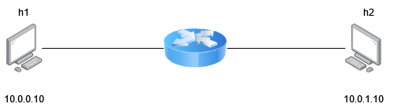

# Simple GTP Router

## Overview

This example creates two hosts connected through a simple router as shown in the  diagram below.



The purpose of this example is to run a gNB script on h1 and a UPF on h2, and the router  filtering the traffic 
depending on the GTP-U TEID.

## Usage

After deploying the package using p4app

```commandline
❯ p4app run examples/simple_gtp_router.p4app
```

Open a command line tab for each of the nodes and execute the following scripts:

```commandline
❯ docker exec -t -i <CONTAINER ID> m h1 bash
root@<CONTAINER ID>:/scripts# python3 /tmp/gtp_gnb.py 10.0.1.10 73
.
Sent 1 packets.
.
Sent 1 packets.
.
Sent 1 packets.
```

```commandline
❯ docker exec -t -i <CONTAINER ID> m h2 bash
root@<CONTAINER ID>:/scripts# python3 /tmp/gtp_upf.py
Received GTP message with TEID 73 from 10.0.0.10
Received GTP message with TEID 73 from 10.0.0.10
Received GTP message with TEID 73 from 10.0.0.10
```